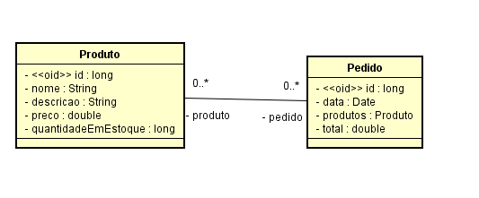

# Teste Técnico Srping Boot
Este projeto foi realizado para um teste de aptidão para o SpringBoot. Para ler mais sobre o teste abra o arquivo Teste.pdf.

## Diagrama UML
O arquivo do Diagrama está localizado na pasta pricipal em Diagrama.asta


## Requisições Produto:

### GET

Listagem em http://localhost:8081/api/produtos


Retorno:
```
[
    {
        "id": 1,
        "nome": "Mouse Mecanico",
        "descricao": "Mouse mecanico super atual",
        "preco": 40.09,
        "quantidadeEmEstoque": 10
    },
    {
        "id": 2,
        "nome": "Teclado Mecanico",
        "descricao": "Teclado Mecanico RGB Bluetooth",
        "preco": 75.99,
        "quantidadeEmEstoque": 3
    },
    {
        "id": 3,
        "nome": "Alexa",
        "descricao": "Alexa inteligente toca musica, som e dispertador",
        "preco": 250.0,
        "quantidadeEmEstoque": 0
    }
]
```

Com ID: http://localhost:8081/api/produtos/1

```
{
    "id": 1,
    "nome": "Mouse Mecanico",
    "descricao": "Mouse mecanico super atual",
    "preco": 40.09,
    "quantidadeEmEstoque": 10
}
```

### POST
Para postar, ele requer que você coloque ele no corpo da requisição em formato JSON.


Local: http://localhost:8081/api/produtos
```
{
    "nome" : "Mouse",
    "descricao" : "mouse semi-mecanico",
    "preco" : "40.99",
    "quantidadeEmEstoque" : "1"
}
```

### DELETE
delete com o ID via ID do produto que você deseja excluir, lembrando que para o delete funcionar é necessario que este produto não esteja vinculado a nenhum Pedido caso contrario não será realizado o delete no banco de dados.


Local: http://localhost:8081/api/produtos4

```
 Retorna apenas um 204 No_Content
```

### PUT
O PUT é bem semelhante pois é utilizado no corpo da requisição e ele utiliza o campo "ID" a mais para fazer as pesquisas.


Local:  http://localhost:8081/api/produtos


Retorno:
```
{
    "id" : 1,
    "nome" : "teclado2",
    "descricao" : "Teclado semi-mecanico2",
    "preco" : "40.99",
    "quantidadeEmEstoque" : "30"
}
```

## Requisições Pedido

### GET

Listagem em: http://localhost:8081/api/pedidos

```
[
    {
        "id": 1,
        "dataDoPedido": "2024-11-01T12:59:40.799+00:00",
        "produtos": [
            {
                "id": 1,
                "nome": "Mouse Mecanico",
                "descricao": "Mouse mecanico super atual",
                "preco": 40.09,
                "quantidadeEmEstoque": 10
            },
            {
                "id": 2,
                "nome": "Teclado Mecanico",
                "descricao": "Teclado Mecanico RGB Bluetooth",
                "preco": 75.99,
                "quantidadeEmEstoque": 3
            }
        ],
        "total": 116.08
    },
    {
        "id": 2,
        "dataDoPedido": "2024-11-01T12:59:40.799+00:00",
        "produtos": [
            {
                "id": 1,
                "nome": "Mouse Mecanico",
                "descricao": "Mouse mecanico super atual",
                "preco": 40.09,
                "quantidadeEmEstoque": 10
            }
        ],
        "total": 40.09
    }
]
```

Com o id via parametro,
Local: http://localhost:8081/api/pedidos/2


Retorno:
```
{
    "id": 2,
    "dataDoPedido": "2024-11-01T13:08:43.811+00:00",
    "produtos": [
        {
            "id": 1,
            "nome": "Mouse Mecanico",
            "descricao": "Mouse mecanico super atual",
            "preco": 40.09,
            "quantidadeEmEstoque": 10
        }
    ],
    "total": 40.09
}
```

### POST 

Para fazer o post dos produtos é apenas necessario o ID dos produtos, no qual ele vai fazer a pesquisa e verificar se o id existe, e se há estoque.


Local: http://localhost:8081/api/pedidos

Enviar no corpo da requisição:

```
{
    "idProdutos" : [1, 2, 4]
}
```
Retorno: 
```
{
    "id": 4,
    "dataDoPedido": "2024-11-01T12:38:36.079+00:00",
    "produtos": [
        {
            "id": 1,
            "nome": "Mouse Mecanico",
            "descricao": "Mouse mecanico super atual",
            "preco": 40.09,
            "quantidadeEmEstoque": 8
        },
        {
            "id": 2,
            "nome": "Teclado Mecanico",
            "descricao": "Teclado Mecanico RGB Bluetooth",
            "preco": 75.99,
            "quantidadeEmEstoque": 1
        },
        {
            "id": 4,
            "nome": "Mouse",
            "descricao": "mouse semi-mecanico",
            "preco": 40.99,
            "quantidadeEmEstoque": 0
        }
    ],
    "total": 157.07
}
```

### PUT

Corpo da requisição: 


Local: http://localhost:8081/api/produtos


```
{
    "id": 1,
    "idProdutos": [1]
}
```

Retorno: 
```
Apenas retorna um NO CONTENT
```

### DELETE

Delete encaminhar apenas o ID via parametro


Local: http://localhost:8081/api/pedidos/1

Retorno:

```
Apenas retorna um NO CONTENT
```